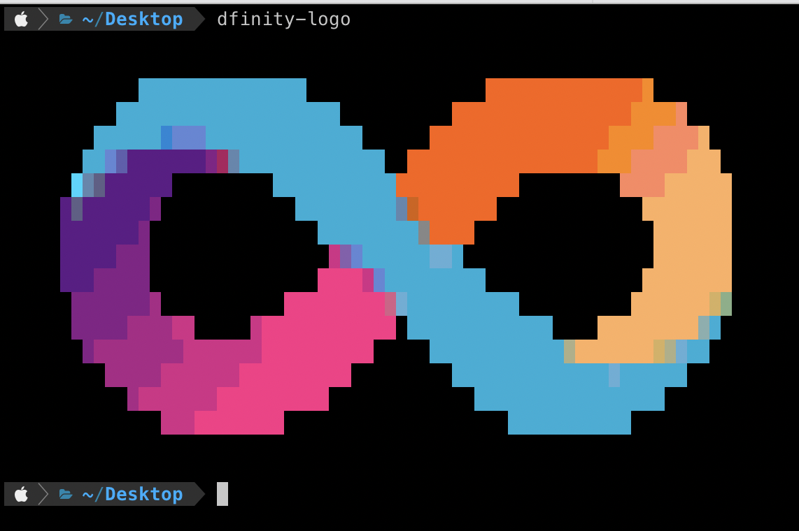

# dfinity-logo

A fun little program that prints the dfinity-logo as ascii-art. Copied from [dfinity/sdk](https://github.com/dfinity/sdk). 

### How to use

First you must build the rust program:

```
$ cargo build --release
```

The binary is located in `dfinity-logo/target/release/`. Copy `dfinity-logo` to somewhere in your path 
and run it with: 

```
$ dfinity-logo
```



I put this at the top of my `.zshrc` to display when opening new terminal sessions.